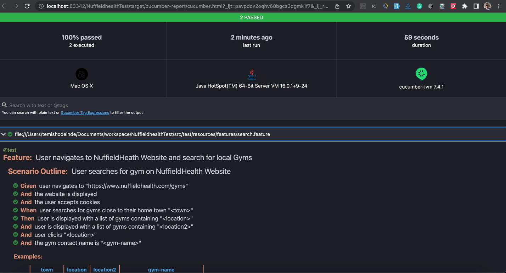

Simple Java Project to Test NuffieldHealth website:
Java
Cucumber
Docker
Selenium WebDriver
Maven
Junit
Selenium Grid
PageObjects

Test can run with either Chrome, Firefox using WebDriver manager or with RemoteWebDriver in selenium grid on docker.
Default browser is Chrome
To run test in Firefox use  `mvn test -Dbrowser=Firefox`

Running Test in Selenium grid on docker
Start `docker-compose -f docker-compose.yaml up` in terminal to start docker
Then run `mvn test -Dbrowser=RemoteDriver`
And use docker-compose -f docker-compose.yaml down in terminal to stop docker

Reports are generated using Cucumber Reports Plugin 

On test failure screenshots are taken using Ashot from yandex and saved in target/errors folder/

